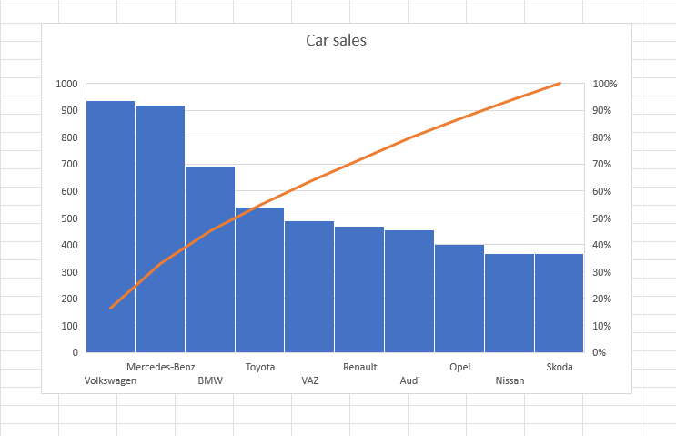

# Map-Reduce

- Learning the basics of **_MapReduce_** for large datasets in **_Python_**.

## Data Description:

- This Data Set consists details of all the **_cars and there sales**
- The Dataset is a free resource from **_[Kaggle](https://www.kaggle.com)_** and can be viewed **_[here](carsalesFinalFile.xlsx)_**.

## Study:

- For this Dataset, I want to find out the total count of car sales Advertisements.

## Execution:

- A **_Mapper Script_** extracts the info from each row in the dataset, which is used as a **_Key_** and a **_Value_** of 1 is assigned to each Key. This is given as input to the **_Sorter_** which sorts all the car info in descending order. Based on the output of the Sorter, which is passed as input to the **_Reducer Script_**

## Powershell Command:

- **_cat car_ad.csv | python mapperCopy.py | sort | python reducerCopy.py > addagalla-output.txt_**

## Summary:

- By examining the final output, we can understand the **_growth of car sales by different companies**

&nbsp;&nbsp;&nbsp;&nbsp;&nbsp;&nbsp;&nbsp;&nbsp;&nbsp;&nbsp;&nbsp;&nbsp;&nbsp;&nbsp;&nbsp;&nbsp;&nbsp;&nbsp;&nbsp;&nbsp;&nbsp;&nbsp;&nbsp;&nbsp;&nbsp;&nbsp;&nbsp;&nbsp;&nbsp;&nbsp;&nbsp;&nbsp; 
